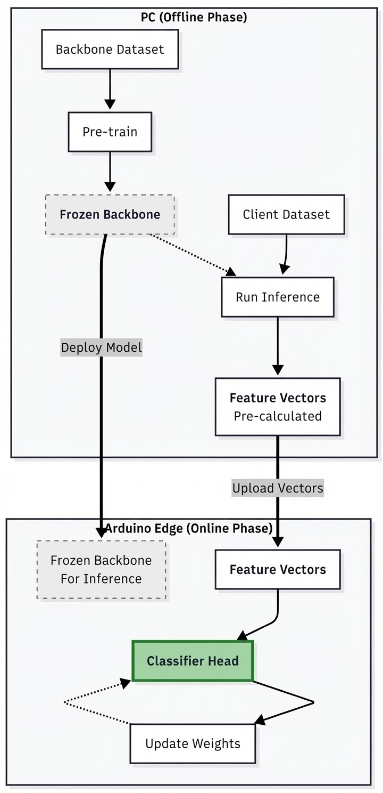
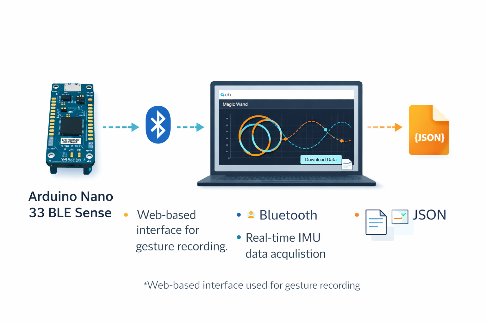
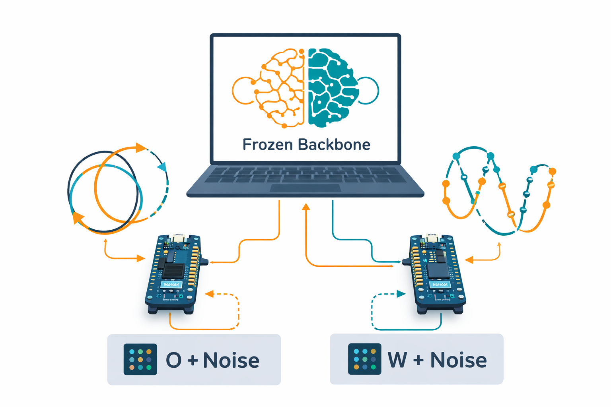

# Gesture Recognition with Arduino and TinyML

Gesture Recognition example for [TensorFlow Lite Micro](https://www.tensorflow.org/lite/microcontrollers) on the [Arduino Nano 33 BLE Sense](https://store.arduino.cc/usa/tiny-machine-learning-kit).

## Introduction

This project implements a motion-based gesture recognition system using two Arduino boards equipped with IMU sensors. The system is designed to recognize spell-based movement patterns, specifically the W and O gestures, while demonstrating how machine learning can be distributed between a personal computer and resource-constrained IoT devices.

The machine learning pipeline follows a hybrid workflow. Data preprocessing, experimentation with different model architectures, and model selection are performed on a PC. After selecting the final model, inference is deployed on the Arduino boards, where motion data is captured and processed in real time using the onboard IMU sensors. Each Arduino device is configured to recognize one specific gesture, illustrating a practical TinyML deployment scenario.

The project covers the complete end-to-end workflow of a machine learning system:

- Data Collection: Gesture data is recorded through a web-based interface using Bluetooth, allowing users to capture, label, and download sensor data.
- Training: The collected data is used to train a gesture recognition model using TensorFlow in a Python environment.
- Deployment: The trained model is converted into a TinyML-compatible format and deployed on Arduino using TensorFlow Lite Micro.

This repository contains the full implementation, including datasets, training scripts, embedded code, and documentation, making it easy to understand, reproduce, and extend the project.

## Hardware Requirements

To run this project, the following hardware is required:

- Arduino Nano 33 BLE Sense: This board is required because the project relies on its built-in Bluetooth capability and IMU sensors. Other Arduino boards are not supported, as they do not provide the same hardware features.
- Micro-USB cable: Used to connect the Arduino board to the computer for programming and power.
- Computer (PC, laptop): A computer running Windows, Linux, or macOS is needed to program the Arduino and run the training pipeline.  
  For data collection through the web-based interface, an up-to-date Chrome browser is required to support Web Bluetooth functionality.

  ## Project Architecture

  

This project adopts a **hybrid and distributed TinyML architecture** designed to operate under strict memory and computation constraints while maintaining reliable gesture recognition performance.

The overall system is divided into two main components: **PC-side processing (offline phase)** and **edge-device processing on Arduino (online phase)**. Computationally intensive tasks are handled on the PC, while lightweight training and inference are performed directly on the Arduino devices.

### PC-side Processing (Offline Phase)

On the PC, raw IMU gesture data is preprocessed and converted into **image-based representations** suitable for convolutional neural networks (CNNs). A shared CNN **backbone model** is trained using a dedicated backbone dataset to learn generic motion features.

After training, the backbone is **frozen**, meaning its parameters are no longer updated. This frozen backbone is then used to extract **feature vectors** from gesture samples. These feature vectors are pre-computed on the PC and transferred to the Arduino devices, eliminating the need for raw data processing or deep feature extraction on resource-constrained hardware.

### Edge-device Processing (Online Phase)

Each Arduino Nano 33 BLE Sense device runs the **frozen backbone for inference only** and trains a lightweight **classifier head** on top of the extracted feature vectors. This significantly reduces both memory usage and computational cost on the device.

The data distribution across devices is intentionally **Non-IID**:
- **Arduino A** is trained on **O + Noise** samples  
- **Arduino B** is trained on **W + Noise** samples  

Each device updates only its local classifier head using its available data, while the shared backbone remains unchanged. This setup reflects realistic edge-computing scenarios where devices observe different subsets of the data.

### Key Design Advantages

- Heavy computation is offloaded to the PC  
- On-device training and inference remain lightweight  
- Memory and computation constraints of Arduino devices are respected  
- The system reflects realistic, distributed IoT learning conditions  

## Installing the Arduino Sketch

Before running the project, make sure you can successfully connect your **Arduino Nano 33 BLE Sense** boards and upload sketches using either the **Arduino Desktop IDE** or the **Arduino Web Editor**. Once you are able to upload a simple test sketch without issues, follow the steps below.

### Arduino Desktop IDE

If you are using the Arduino Desktop IDE, start by downloading the project files or cloning this repository using Git. Open the main `.ino` file in the Arduino IDE and ensure that the correct **board type** (Arduino Nano 33 BLE Sense) and **port** are selected.

This project depends on the following Arduino libraries, which must be installed manually via:

**Sketch → Include Library → Manage Libraries**

- **[Arduino_LSM9DS1](https://github.com/arduino-libraries/Arduino_LSM9DS1)** (version 1.1.0 or newer)  
  Used to access accelerometer and gyroscope data from the onboard IMU.

- **[ArduinoBLE](https://www.arduino.cc/en/Reference/ArduinoBLE)** (version 1.1.3 or newer)  
  Used for Bluetooth communication during data collection and interaction with the web-based interface.

After installing the required libraries, connect the Arduino board using a USB cable and click the **Upload** button to compile and install the sketch.

### Arduino Web Editor

When using the Arduino Web Editor, no manual library installation is required. The editor automatically selects the latest compatible versions of all required libraries. Simply open or copy the project sketch into the web editor, connect the Arduino board, select the correct device, and press **Upload** to install the sketch.

## Viewing Gestures in the Browser

The data for this project were collected using the official Magic Wand web interface, [using this browser-side Javascript in a static HTML page](https://petewarden.github.io/magic_wand/website/index.html) which connects to the IMU-equipped Arduino via Bluetooth, allowing users to perform gestures, record sensor data, label each gesture, and then download the resulting datasets.

  

If the sketch has uploaded successfully, the Arduino should be advertising itself through Bluetooth. On the web page, press the 'Bluetooth' button to connect, and you should see a dialog appear asking you to pair with a device. After a second or two, there should be an entry that looks something like "BLESense-2F00". Click on that to pair, and you should be returned to the web page.

If everything is working as expected, the Bluetooth button should turn blue, with "Connected" next to it. Now try moving the Arduino and look at the square below the button. As you gesture, you should see tracks appearing as lines in the web page in real time.

## Recording Gestures

As gestures are recorded, they appear in a stack on the right side of the web page. This stack temporarily stores the recorded gesture samples that will later be used for training the machine learning model. Since the recorded data will be lost if the page is refreshed or closed, all collected gestures must be saved locally using the **Download Data** option.

Gestures are automatically segmented based on periods where the device remains still. These short pauses act as natural separators between individual gesture samples. To ensure clean segmentation, users stop moving the Arduino briefly after completing each gesture.

For this project, two spell-based gestures, **W** and **O**, were recorded. As each gesture was performed, its shape was visualized in the gesture stack, allowing immediate visual inspection of data quality. This visualization step was important to ensure that the recorded gestures were clear, consistent, and distinguishable.

After recording multiple samples, the gesture stack was reviewed and low-quality or ambiguous samples were removed using the delete option. This process helped improve the overall quality of the dataset. Each remaining gesture sample was then manually labeled with the correct class name (e.g., `W`, `O` or `N`).

Once all gesture samples were reviewed and labeled, the dataset was downloaded in **JSON format**, which was later used for preprocessing and training the gesture recognition model.

- Note: The web-based gesture recording interface used for data collection is adapted from the Magic Wand example project by Pete Warden.

## Training

  

The training process is performed on a PC and focuses on learning compact and transferable representations of motion-based gestures.

Instead of directly modeling raw IMU time-series data, each gesture is first converted into an **image-based representation** that captures the trajectory and motion pattern over time. This transformation simplifies the learning problem and enables the use of efficient convolutional neural networks.

A shared **CNN backbone** is trained using a dedicated subset of the dataset to learn generic motion features that are independent of a specific gesture class. After training, the backbone is frozen and reused across all devices, ensuring consistent feature extraction.

The model architecture and training process are designed with **TinyML constraints in mind**, favoring compact layers and lightweight operations to enable deployment on resource-constrained hardware.

Training is implemented in a Python environment using TensorFlow and is available as a Colab notebook for reproducibility.

## Deployment

After training, the model is deployed to Arduino Nano 33 BLE Sense devices using **TensorFlow Lite Micro**.

To meet the strict memory and computation limits of the Arduino platform, the deployment follows a lightweight inference strategy:
- The CNN **backbone remains frozen** and is used only for feature extraction
- Only a small **classifier head** is executed and updated on the device
- No raw image processing or deep training is performed on the Arduino

This design ensures that on-device inference and training remain efficient while respecting **TinyML constraints**, including limited RAM and flash memory. As a result, the system can perform real-time gesture recognition directly on the edge devices with minimal computational overhead.

Upload this modified sketch, and you should be able to perform gestures and see them recognized in the Serial Monitor of your Arduino editor.

